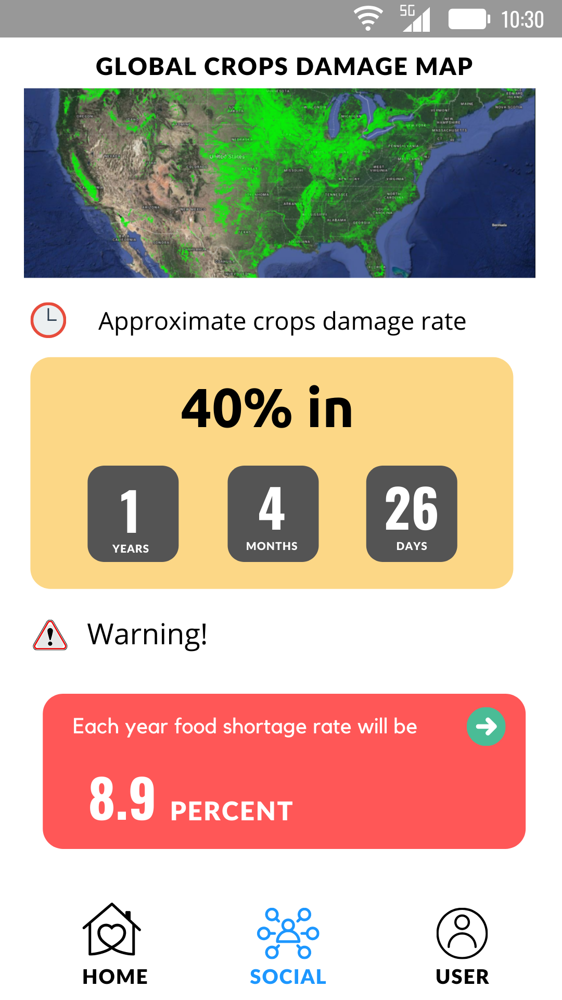

<h2 align="center">Team Green X</h2>
 
<h2 align="center">NASA Space Apps Challenge 2021
</h2>
 

## Problem: ##
## Warning: Things are heating up! ##
 
<blockquote>Climate change is expected to exacerbate heat-related extremes that impact human health and environmental and ecological systems. Your challenge is to build a tool that uses Earth Observations (EO), crowdsourced data, and models to provide warnings about potential impacts of these events, along with guidance on mitigation measures.
</blockquote>
 

## What we are Solving & it's Impact: ##

<blockquote> We're taking a variety of ways to solve this problem. Our objective is to raise public awareness about the temperature of the earth's surface. We're working on an app that will utilize Nasa satellite data and our unique IoT device, Air IoT, to collect real-time temperature readings and predict the temperature of the earth's surface using supervised machine learning and deep learning.
When the temperature rises, chemical reactions between primary air pollutants such as nitrogen oxides (emitted by engines) and oxygen occur, resulting in the formation of ozone and air pollution. Forest fires will become more common as the temperature rises, causing more agricultural damage. We can provide agricultural damage, air pollution, and forest fire warnings via the mobile app based on the heat forecast data. The app shows the rate of temperature rise in accordance with the date, as well as warnings for specific locations based on the condition. The app further depicts based on the heat map global air pollution rising-rate accordance to the date as well as a set alert warning based on the condition. The app also displays the rate of global air pollution growing over time, as well as triggering alerting warnings dependent on the situation. The app further depicts the rate of global crop damage over time, as well as triggering alerting warnings about food shortage dependent on the situation. This will encourage people to plant trees and contribute to the lowering of global temperatures.
Earth's surface temperature is quickly rising, and it is now impossible to totally reduce it. As a result, we may rapidly cut carbon dioxide emissions, resulting in a gradual increase in global temperature. We are utilizing a customized unmanned aerial vehicle (UAV) to reduce the earth's surface temperature by dropping seed balls into deforested areas at a rapid rate, increasing the rate of forestation.
</blockquote>
 

## Hardware: ##

<blockquote>

**Air IoT:**
 
Air IoT is an [ESP32](https://www.espressif.com/en/products/socs/esp32) based IoT device for collecting real-time crowdsourcing data. We use these sensors in our device: [Temperature Sensor](https://www.dfrobot.com/product-174.html),
[Air Humidity Sensor](https://www.dfrobot.com/product-174.html),
[Light Sensor](https://www.adafruit.com/product/4162),
[C02 Detector](https://www.dfrobot.com/product-1549.html), 
["PM1.0, PM2.5 and PM10.0 Particale detetor"](https://www.adafruit.com/product/3686).

We are using HTTP Post Request to send real time data from Air IoT.

We are using IoT Server [iotsnackbox.io](https://iotsnacksbox.io/) to store data.
</blockquote>
 

<blockquote>

**UAV:**
 
 Our UAV's name is Green Source. we use this UAV to reduce the earth's surface temperature by dropping seed balls into deforested areas at a rapid rate, increasing the rate of forestation. It is specially designed for dropping seed balls. To build this UAV we are using "pixhawk flight controller", M8N GPS, 8CH Transmitter & Receiver.
 

  

 
Specially designed dropper for dropping seed balls.

  

</blockquote>
 

## Software: ## 

<blockquote>

**UI:**

1. Login panel.

  

2. The app will show the rate of temperature rise in accordance with the date, as well as warnings for specific locations based on the condition. 

  

3. The app further depicts based on the heat map global air pollution rising-rate accordance to the date as well as a set alert warning based on the condition. The app also displays the rate of global air pollution growing over time, as well as triggering alerting warnings dependent on the situation. 

  

4. The app will show the rate of deforestation rise in accordance with the date, as well as the rate of forestation for specific locations based.

  

5. The app further depicts the rate of global crop damage over time, as well as triggering alerting warnings about food shortage  dependent on the situation.

  

</blockquote>
 

<blockquote>

**Data:**

</blockquote>
